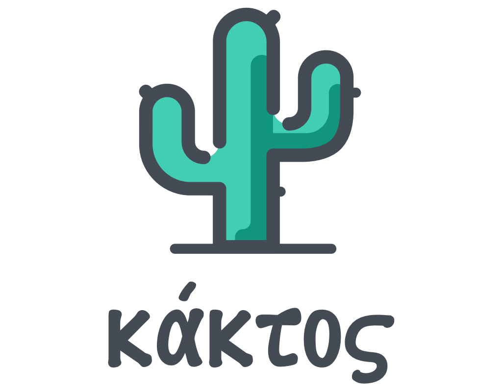

<p align="center">
    <a href="https://github.com/paulocoutinhox/kaktos" target="_blank" rel="noopener noreferrer">
        
    </a>
    <br>
    <br>
    Python static site generator
    <br>
</p>

<br>

# κάκτος

[](https://github.com/paulocoutinhox/kaktos/actions/workflows/build.yml)

Kaktos is a python static site generator.

The idea is create a simple static site generator for people that don't need server-side languages.

Designers can use it too, since it don't need people that know a programming language.

## Demo

**Cloudflare:**

[https://kaktos.pages.dev](https://kaktos.pages.dev)

**Netlify:**

[https://kaktos.netlify.app](https://kaktos.netlify.app)

**Amplify:**

[https://main.d27ze19drzixy0.amplifyapp.com](https://main.d27ze19drzixy0.amplifyapp.com)

## Requirements

- Python 3.8+

## Setup

Install python dependencies:

```bash
python3 -m pip install -r requirements.txt
```

## Development

To work in development mode, you only need execute one command:

```bash
python3 kaktos.py
```

When you change any file locally, the server will `process` it again and `auto-refresh` on browser.

This command *always force* use development mode, with or without environment variable.

## Production

To generate production files, you only need execute one command:

```bash
python3 kaktos.py build
```

All files will be generated in `build` folder.

If you set environment variable `KAKTOS_DEBUG=True`, kaktos will build all files for development mode, example:

```bash
KAKTOS_DEBUG=True python3 kaktos.py build
```

## Deploy

**Netlify:**

[](https://app.netlify.com/start/deploy?repository=https://github.com/paulocoutinhox/kaktos)

**Render:**

[](https://render.com/deploy?repo=https://github.com/paulocoutinhox/kaktos/tree/render-support)

## Structure

- `kaktos.py` = main file that process your command
- `requirements.txt` = python dependency list
- `templates/layouts` = folder for all layouts that pages can inherit
- `templates/pages` = folder for pages that will be generated
- `templates/shared` = folder for parts of layouts that can be shared with other layouts
- `modules` = kaktos modules
- `modules/config.py` = configuration file
- `files` = folder that contains all assets and custom files

## Templates

All templates (html files) are based on Jinja2 library. You can see it here:

https://jinja.palletsprojects.com/en/3.0.x/

## Troubleshooting

#### **• Python version**

Each service that build the static content automatically use a specific python version.

If you need change the python version used to build all files and pages, edit file `runtime.txt` and change to `3.8`, `3.9` or other.

These services that im using have this python version:

- Netlify: Python 3.8 (https://docs.netlify.com/configure-builds/available-software-at-build-time/)
- Cloudflare Pages: Python 3.11.5 (https://developers.cloudflare.com/pages/configuration/language-support-and-tools)

#### **• Template changed, but not reloaded**

Invalid Jinja2 syntax can prevent your HTML template from being built.

Check your terminal to see the error message, the HTML file and the line number where invalid syntax was detected.

## Buy me a coffee

<a href='https://ko-fi.com/paulocoutinho' target='_blank'></a>

## Images

All images for demo i got from:

https://unsplash.com/

## License

[MIT](http://opensource.org/licenses/MIT)

Copyright (c) 2021-2024, Paulo Coutinho
