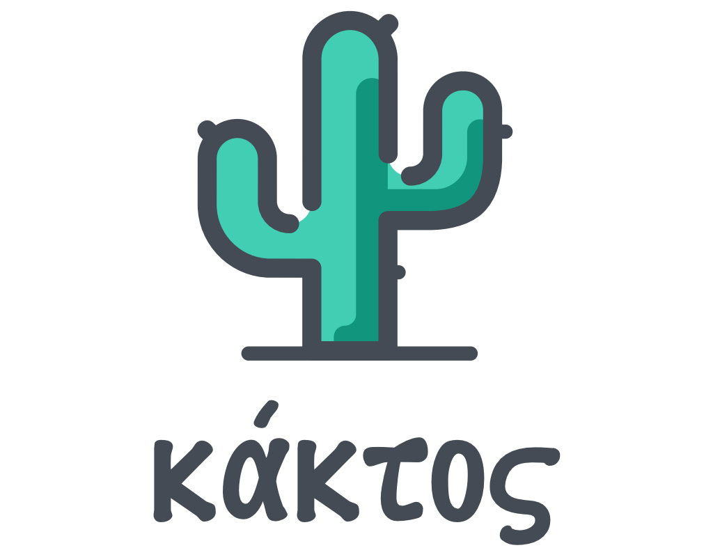

<p align="center">
    <a href="https://github.com/paulocoutinhox/kaktos" target="_blank" rel="noopener noreferrer">
        
    </a>
    <br>
    <br>
    Python Static Site Generator for Serverless Applications 🚀
    <br>
</p>

<br>

# Kaktos — *κάκτος* (Greek for “cactus”)

[](https://github.com/paulocoutinhox/kaktos/actions/workflows/build.yml)

Kaktos is a powerful **Python Static Site Generator** designed to create highly efficient **serverless** applications. Why pay for hosting when you can deploy a completely static site for free?

Create beautiful static websites, e-commerce stores, blogs, landing pages, and sales pages with **advanced pagination** and **dynamic features**, all without the hassle of server-side dependencies! 💻

## ✨ Features

- **Static Website Generator** – Create responsive, fast, and secure static sites 🖼️
- **Static E-commerce** – Build fully functioning static shopping websites 🛒
- **Static Blog** – Advanced blog with pagination and dynamic content 📝
- **Landing Pages & Sales Pages** – Perfect for creating high-conversion pages for any purpose 🛍️
- **Easy to Use** – Intuitive design that requires no server-side programming 💡
- **Serverless** – Deploy to platforms like Netlify, Cloudflare, or Render with no need for server management ☁️
- **Many Free Hosting Options** – Many companies offer free hosting for static sites, as no server-side processing is required 🌐
- **Fast & Secure** – Static sites are inherently faster and more secure ⚡
- **No Hosting Fees** – Fully serverless deployment means **no hosting costs** 🆓
- **SEO Optimized** – Generate clean, SEO-friendly pages 🕵️‍♂️
- **Customizable Templates** – Based on the powerful Jinja2 templating engine 🎨
- **Integrated frontend** – All CSS, JavaScript, and images live under `frontend/`, the Python build runs Vite and npm for you, and the site UI is styled with **Tailwind CSS** ⚙️

## 🤔 Why Kaktos?

With **Kaktos**, you can deploy your website without worrying about server management, database configuration, or paying for hosting. Focus on your content, and let Kaktos handle the rest. Enjoy the benefits of a **serverless architecture**, which has become a major trend in web development, reducing operational costs and simplifying the deployment process for companies of all sizes.

- No need to manage infrastructure
- No ongoing hosting fees
- Scalable and fast deployment
- Ideal for websites, blogs, e-commerce, and landing pages

## 🔄 All-in-One Solution

Unlike most static site generators, which focus on specific tasks, **Kaktos** provides an **all-in-one** solution.

Whether you need to build a blog, an e-commerce store, a landing page, or any other static website, Kaktos brings it all together in one platform, simplifying your workflow and allowing you to manage everything in a single place.

## 🎬 Demo

**Cloudflare:**

[https://kaktos.pages.dev](https://kaktos.pages.dev)

**Netlify:**

[https://kaktos.netlify.app](https://kaktos.netlify.app)

**Amplify:**

[https://main.d27ze19drzixy0.amplifyapp.com](https://main.d27ze19drzixy0.amplifyapp.com)

**Render:**

[https://kaktos.onrender.com](https://kaktos.onrender.com)

## Requirements

- **Python** 3.9+
- **Node.js** **20.19+** or **22.12+** (LTS **22** recommended) and **npm** on your `PATH` so the Python build can invoke **Vite 8** (you never run `npm` yourself for normal development or production builds). The repo pins **22** via **`.nvmrc`**, **`netlify.toml`**, **`render.yaml`**, and **`amplify.yml`** where the host reads them.

## 🚀 How to Get Started

### Installation

#### Option 1: Using Virtual Environment (Recommended)

Using a virtual environment is the recommended approach as it keeps your project dependencies isolated from your system Python installation.

1. **Create a virtual environment:**

```bash
python3 -m venv venv
```

2. **Activate the virtual environment:**

   - **On macOS/Linux:**
   ```bash
   source venv/bin/activate
   ```

   - **On Windows:**
   ```bash
   venv\Scripts\activate
   ```

3. **Install dependencies:**

```bash
pip install -r requirements.txt
```

4. **Deactivate the virtual environment** (when you're done working):

```bash
deactivate
```

#### Option 2: Direct Installation

If you prefer to install dependencies directly to your system Python:

```bash
python3 -m pip install -r requirements.txt
```

> **Note:** It's recommended to use a virtual environment (Option 1) to avoid conflicts with other Python projects.

## 💻 Development

To work in development mode, you only need execute one command:

```bash
python3 kaktos.py
```

With **`python3 kaktos.py`** you get one integrated dev loop: **LiveReload** watches the paths below, runs **`build_pages()`** on each save (Vite for CSS/JS in `frontend/src/`, then Frozen-Flask for HTML from `templates/`, then copies **`frontend/dist/`** to **`build/static/`** and `frontend/raw/` into `build/`), and then asks the browser to refresh when the tab is connected.

What triggers a rebuild:

- **HTML (Jinja pages and partials)** — anything under `templates/`
- **CSS and JS processed by Vite** (including Tailwind) — under `frontend/src/` (for example `main.css`, `main.js`)
- **Static files merged into the Vite output** — under `frontend/public/` (images, etc.; published under `/static/…`)
- **Files at the site root after build** — under `frontend/raw/` (favicon, `robots.txt`, …)
- **Tooling** — `frontend/package.json`, `frontend/package-lock.json` if present, and root configs in `frontend/` matching `vite.config.*`, `tailwind.config.*`, `postcss.config.*`, or `eslint.config.*`

Each cycle completes the Vite step before the static pages are regenerated so `build/` stays consistent. The browser may skip a rapid second reload within a few seconds (LiveReload throttling)—see **Troubleshooting** if needed.

This command *always* forces development mode, with or without environment variable.

You only run **`python3 kaktos.py`** for local development and **`python3 kaktos.py build`** for production output. Dependencies under `frontend/` are installed automatically on first build when needed.

## 🏭 Production

To generate production files, you only need execute one command:

```bash
python3 kaktos.py build
```

All files will be generated in `build` folder.

If you set environment variable `KAKTOS_DEBUG=True`, kaktos will build all files for development mode, example:

```bash
KAKTOS_DEBUG=True python3 kaktos.py build
```

If you want start a web server to test files inside `build` folder use:

```bash
python3 kaktos.py serve
```

## 📦 Deploying with One Click

**Netlify:**

[](https://app.netlify.com/start/deploy?repository=https://github.com/paulocoutinhox/kaktos)

**Render:**

[](https://render.com/deploy?repo=https://github.com/paulocoutinhox/kaktos/tree/render-support)

## 🏗️ Project Structure

- `kaktos.py` — main entrypoint that dispatches commands
- `requirements.txt` — Python dependencies
- `templates/layouts` — base layouts pages extend
- `templates/pages` — page templates (frozen routes)
- `templates/shared` — partials, macros, shared fragments
- `modules/` — Python code (`config.py`, routes, `frontend.py`, …)
- `frontend/` — all **CSS, JS, and images** for the site:
  - `frontend/src/` — Vite entry (`main.js`, Tailwind `main.css`)
  - `frontend/public/` — static files copied into `/static/…` (logos, gallery images, etc.)
  - `frontend/raw/` — files copied to the **build root** (favicon, `robots.txt`, `CNAME`, `site.webmanifest`, …); **nothing here runs through Vite**—they are copied as-is to the published site root, unlike `frontend/public/`, which is emitted under `/static/…`.
  - `frontend/package.json` / `vite.config.js` — Node toolchain (invoked only from Python)
- `extras/config/` — YAML sample data (blog posts, products, categories)

## 🎨 Frontend assets in templates

Static assets are split by folder: anything under **`frontend/public/`** is published under **`/static/…`** (on disk: **`build/static/`**). Anything under **`frontend/raw/`** is copied to the **root** of the generated site (same path as in that folder, e.g. `/robots.txt`). In Jinja you reference them with **`kaktos.frontend`** so you never hard-code hashed filenames or the `/static` URL prefix.

### `kaktos.frontend` API

| Call | Resolves |
|------|-----------|
| `{{ kaktos.frontend.url('images/logo.png') }}` | `frontend/public/images/logo.png` → `/static/images/logo.png` |
| `{{ kaktos.frontend.root_url('favicon.ico') }}` | `frontend/raw/favicon.ico` → `/favicon.ico` |
| `{{ kaktos.frontend.abs_url('images/logo-og.png') }}` | Same as `url()` but absolute for **Open Graph / sharing**, using `config.base_url` (pass through unchanged if the value already starts with `http://` or `https://`) |
| `{{ kaktos.frontend.styles_all() }}` | Injects `<link>` tags for **every** Rollup input entry’s CSS (sorted, deduped) |
| `{{ kaktos.frontend.scripts_all() }}` | Injects `<script type="module" … defer>` for **every** Rollup input entry’s JS (sorted) |
| `{{ kaktos.frontend.styles_for('main') }}` | Same as `styles_all()` but only for the named entry (e.g. split layouts) |
| `{{ kaktos.frontend.script_for('main') }}` | Same as `scripts_all()` but only for the named entry |

The default layout uses **`styles_all()`** in `templates/shared/head.html` and **`scripts_all()`** in `templates/shared/footer.html` so new Vite inputs in `frontend/vite.config.js` are picked up automatically. Use **`styles_for('…')`** / **`script_for('…')`** when you need explicit control (per-page bundles, order, or omitting entries).

**Gallery folders on disk:** set **`gallery_dir`** in `modules/config.py` (absolute path). The gallery template uses `file.find_dirs(kaktos.config.gallery_dir, "*")` so you can point it anywhere without changing core code. Thumbnails use **[GLightbox](https://github.com/biati-digital/glightbox)** (`glightbox` on the link + `data-gallery` per album); adjust options in `frontend/src/main.js` if needed.

Layout helpers **`page_container_start`** / **`page_container_end`** live in `templates/shared/macros.html` (optional wrappers around the main content column).

### Examples (inline)

```jinja

<a href="{{ kaktos.frontend.root_url('ads.txt') }}">Ads</a>
<meta property="og:image" content="{{ kaktos.frontend.abs_url('images/logo-og.png') }}">
```

### YAML and data files

Use paths **relative to `frontend/public/`** in YAML (e.g. `images/blog/post.jpg`), then in templates wrap dynamic fields with **`kaktos.frontend.url(...)`** when outputting `src` or `href` (unless the field is already a full `https://` URL).

## 🔧 Commands

Each command supported by **Kaktos** is a Python file located in the `modules/commands/` folder.

To add new commands, simply create a new Python file in the `modules/commands/` folder and implement the `def run(params={})` method within it.

## 📝 Templates

All templates (html files) are based on Jinja2 library. You can see it here:

https://jinja.palletsprojects.com/en/stable/

## 🛠️ Troubleshooting

#### **• Python version**

CI and local builds use the Python you configure. The repo includes `.python-version` (e.g. 3.13) for tools that respect it.

Hosting platforms ship their own Python and Node images. See their current defaults and how to pin a version:

- **Netlify** — [Available software at build time](https://docs.netlify.com/configure-builds/available-software-at-build-time/)
- **Cloudflare Pages** — [Build image / language support](https://developers.cloudflare.com/pages/configuration/build-image/)
- **Render** — [Environment](https://render.com/docs/environment) and [native runtimes](https://render.com/docs/native-runtimes)

#### **• Node / npm not found or “Vite requires Node.js …”**

Install [Node.js](https://nodejs.org/) **22 LTS** (or **20.19+**). On hosts that ignore `.nvmrc`, set **`NODE_VERSION=22`** (or equivalent) in the service environment. You still only run `python3 kaktos.py` or `python3 kaktos.py build`; the first run installs `frontend/node_modules` when needed.

#### **• LiveReload did not refresh the browser**

Keep the tab open so the LiveReload WebSocket stays connected (the static `build/` output still updates on disk even if the browser skips a reload). The bundled livereload client also **ignores extra reload signals** if they arrive within a few seconds of the last one—if you save many files in quick succession, do one manual refresh once the terminal shows `building done`.

#### **• Template changed, but not reloaded**

Invalid Jinja2 syntax can prevent your HTML template from being built.

Check your terminal to see the error message, the HTML file and the line number where invalid syntax was detected.

## ☕ Buy Me a Coffee

<a href='https://ko-fi.com/A0A412XEV' target='_blank'></a>

## 🖼️ Images

Place images under **`frontend/public/images/`** (see sample layout: `images/logo.png`, `images/gallery/…`, `images/blog/…`). Demo stock photos were sourced from [Unsplash](https://unsplash.com/).

## 📜 License

[MIT](http://opensource.org/licenses/MIT)

Copyright (c) 2021-2026, Paulo Coutinho
